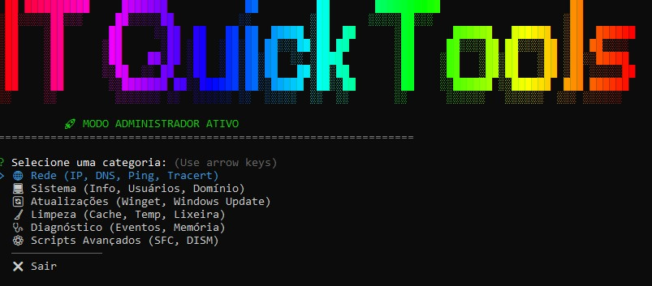

# IT Quick Tools

O **IT Quick Tools** é uma aplicação de linha de comando (CLI) desenvolvida em **Node.js** para facilitar a vida de técnicos de TI e usuários avançados.  
A ideia é simples: **unificar comandos espalhados do Windows** (CMD, PowerShell, Winget) em uma interface **rápida e interativa**.

## 🚀 Funcionalidades

### 🌐 Rede
Ferramentas essenciais para troubleshooting de conectividade:

- Ver IP e detalhes da interface  
- Flush DNS (limpeza de cache)  
- Ping Tester (Google DNS)  
- Trace Route (rastreamento de pacotes)  

---

### 💻 Sistema
Informações rápidas e úteis sobre o dispositivo:

- Hostname e usuário atual  
- Serial Number (BIOS / Service Tag)  
- Versão e Build do Windows  
- Lista de discos e espaço livre  

---

### 🧹 Limpeza
Manutenção preventiva para liberar espaço (Modo Verbose):

- Limpeza da pasta `%TEMP%`  
- Esvaziar Lixeira via PowerShell  
- Limpeza do Prefetch (requer Admin)  
- Remoção de downloads antigos do Windows Update (requer Admin)  

---

### 🔄 Atualizações
Ferramentas para manter o sistema sempre atualizado:

- Atualização de softwares via Winget (tudo de uma vez)  
- Forçar verificação de Windows Update  
- Atualização das definições do Windows Defender  

---

### 🩺 Diagnóstico e Avançado
Atalhos para ferramentas e verificações importantes:

- Abrir Task Manager, Event Viewer e DxDiag  
- Verificação de integridade (SFC /Scannow)  
- Reparo de imagem do sistema (DISM)

