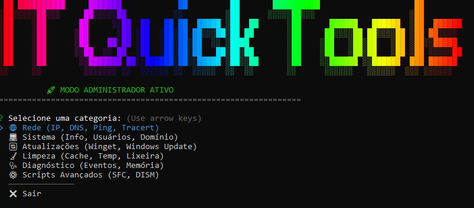

# IT Quick Tools




O **IT Quick Tools** e uma aplicacao de linha de comando (CLI) interativa desenvolvida em **Node.js** para administracao, suporte tecnico e manutencao do sistema operacional Windows.

A ferramenta unifica rotinas administrativas e operacionais (CMD, PowerShell, Winget, CIM/WMI) sob uma interface de terminal estruturada, modular e sem dependencias visuais superfluas.

---

## Funcionalidades

### Modulo de Rede
Diagnostico rapido de conectividade e resolucao de nomes:
- Mostrar IP e configuracoes de rede (`ipconfig`)
- Limpar cache DNS do sistema (`flushdns`)
- Teste de conectividade com DNS primario do Google (`ping`)
- Rastreamento de rota de pacotes (`tracert`)

---

### Modulo de Sistema
Inspecao e inventario de hardware e sistema operacional via CIM:
- Hostname e identificacao do usuario ativo (`whoami`)
- Numero de serie e fabricante via BIOS (`Win32_Bios`)
- Versao e build do Windows (`Win32_OperatingSystem`)
- Inventario de discos e espaco disponivel (`Win32_LogicalDisk`)

---

### Modulo de Limpeza
Expurgo de dados temporarios e manutencao preventiva de armazenamento:
- Limpeza de arquivos temporarios do usuario (`%TEMP%`)
- Esvaziamento da Lixeira via PowerShell (`Clear-RecycleBin`)
- Limpeza de prefetch do Windows (requer privilegios de Administrador)
- Expurgo do cache do Windows Update (`SoftwareDistribution\Download`)

---

### Central de Atualizacoes
Gerenciamento centralizado de atualizacoes de software e seguranca:
- Atualizacao em lote de programas instalados via Winget
- Atualizacao das definicoes de virus do Windows Defender (`MpCmdRun.exe`)
- Disparo do ciclo de varredura do Windows Update (`USOClient StartScan`)

---

### Modulo de Diagnostico e Scripts Avancados
Atalhos diretos e utilitarios de reparo profundo de integridade:
- Abertura imediata de Task Manager, Event Viewer, DxDiag, Gerenciador de Dispositivos e PerfMon
- Agendamento de diagnostico de memoria RAM (`mdsched`)
- Verificacao de arquivos de sistema (`sfc /scannow`)
- Diagnostico e restauracao da imagem do Windows (`DISM`)
- Verificacao de integridade de disco em modo leitura (`chkdsk`)

---

## Instalacao e Execucao

### Pre-requisitos
- Windows 10 ou 11
- Node.js 18 ou superior instalado
- Terminal com privilegios de Administrador (para funcoes avancadas de reparo e limpeza)

### Execucao Direta
```bash
# Instalar dependencias
npm install

# Iniciar aplicacao
node index.js
```

### Instalacao como Utilitario Global (CLI)
Para disponibilizar o comando `itquicktools` globalmente no PowerShell ou CMD:
```bash
# Na raiz do projeto:
npm link

# Em qualquer terminal:
itquicktools
```

---

## Testes Automatizados

A aplicacao utiliza o runner nativo de testes do Node.js (`node:test`) com assercoes estritas (`node:assert/strict`):

```bash
npm test
```
